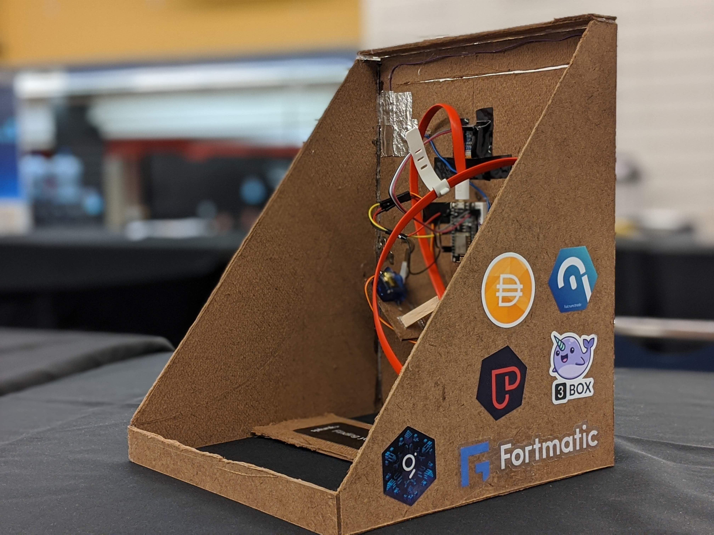
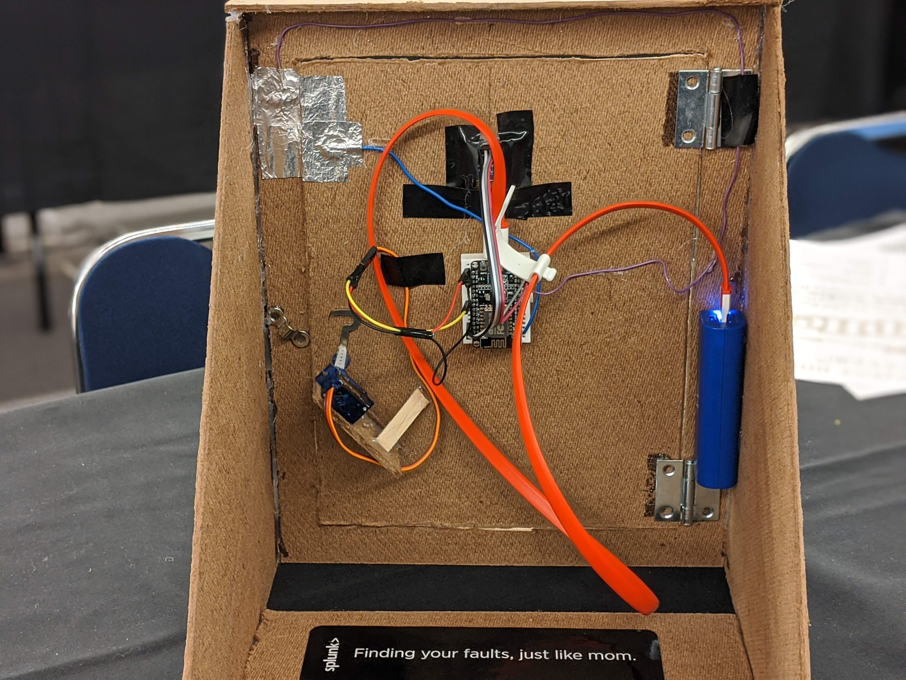

Presentation - https://drive.google.com/file/d/1pp87Ic61vqj5aMQDQQ_8UXP7o-WDia0p/view

Team:
- Haardik (B8##0642)
- Jason Du (Jason | KingdomsBeyond.com#4570)
- Ryan Ouyang (Wertsdf#1773)
- Jonathan Xu (Jonathan#1335)

Bounties:
- Maker Foundation DSR Challenge
- Best Overall 3Box Integration
- Best Use of 3Box Storage
- Build the Best bZx Product
- Best Project With Fortmatic Integration
- Infura API Usage
- Pepo The UX Awards!
- The Graph - Build a subgraph to index your smart contracts
# Inspiration
#BUILDLed at ETHDenver 2020

We recognize that decentralized applications strive to be 'zero fees' for transfers among users.
However, there is no good way of monetizing the service as a result. 
How is it possible to monetize a smart contract for a service while maintaining 0 fees? 

Introducing **LedgerLocker**...

# Staking Protocol
We built a generic staking protocol that allows smart contract owner to earn interest while maintaining account balances.
Any DAI that is received from the smart contract can be directed to DSR where the smart contract owner is the recipient of the interest. 

We want users to keep their funds but also allow smart contract owners to monetize their services through interest.

Think POOLTOGETHER but instead the balance is going straight to the owner. 

## How it works

Any time DAI gets transferred into the smart contract, the smart contract will convert the DAI into DSR.
The smart contract keeps a balance of the DAI for each user. As such, when a user wants to withdraw,
the smart contract will take the DAI out from DSR and transfer it back to the user.
The smart contract owner earns all of the interest generated by the DAI as payment for the service.
In our smart contracts, we chose to use DAI, however we built our smart contract in a generalized way 
such that it can be extended to multiple lending tokens such as Fulcrum or Compound. Additionally, it can
be abstracted to use ANY ERC20 or ETH and earn interest off of it.

## Use Cases

### ETHDenver Staking
The ETHDenver staking contract: https://etherscan.io/address/0xcf4301f7f4315e98b6ecdc5df67d18f68c1e7720

The numbers: **$82,978.94** is currently staked and just sitting in the smart contract.

We are able to integrate the Staking Protocol fairly easily to manage user funds while earning interest on $82k.
With the current DSR of **7.5%**, and an assumption that the current balance will be staked for just 1 month.

$82,978 * 0.075 / 12 = **$518.61** that could be potentially earned by the ETHDenver team.

That's 26 **B IS FOR BUFFICORN** Books!!

### DAOs

DAOs can use this general protocol to collect DSR for the DAO. Voting can occur on how to distribute the rewards.
There can be certain rewards to staking your DAI for the DAO. 

# Hardware Prototype

We decided to use apply this protocol to a specific use case for demoing: the experience of home leasing. In this example, a person looking to lease a home stakes an amount correlating to the daily rent price. They then check in by entering a generated code displayed at the door, and can unlock the door via a portal app.

This fee-free model allows homeowners to charge less, while enabling the service to run sustainably.

For the proof of concept, we built a working door (with open AND close functionality). It has an OLED display that shows the door's state and the unique ID sent to the door. The entire hardware prototype is based off an ESP8266 device, which sends and receives data via WebSockets. The piece of aluminum on the side of the frame lets the door detect if it's closed so that it can lock itself after the user. The latch is controlled by a TowerPro SG90 servo motor.

# Front End

